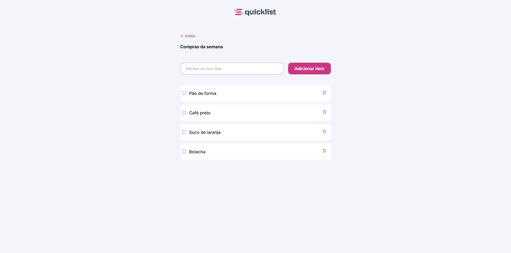
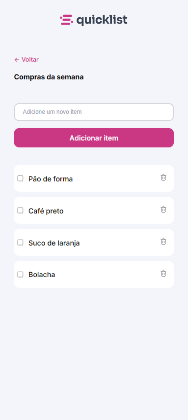

# 🛒 Lista de Compras

Projeto desenvolvido com HTML, CSS e JavaScript puro (vanilla) com base em um layout no Figma. A aplicação permite ao usuário adicionar, marcar, remover e apagar múltiplos itens de uma lista de compras, com alerta visual temporário para ações de exclusão.

## ✨ Funcionalidades

- ✅ Adicionar novo item à lista
- ✅ Marcar/desmarcar itens com checkbox
- ✅ Remover item individual com botão de lixeira
- ✅ Remover todos os itens marcados
- ✅ Alerta visual por 3 segundos ao remover itens
- ✅ Atualização automática da exibição do botão de remover selecionados

## 🧱 Tecnologias Utilizadas

- HTML5 semântico
- CSS3 com variáveis e organização modular
- JavaScript moderno (ES6+)
- Figma (para base do layout)

## 📁 Estrutura de Pastas

```
Lista de Compras/
├── assets/              # Ícones e imagens
├── style/               # CSS organizado por responsabilidade
│   ├── global.css
│   ├── main.css
│   ├── buttons.css
│   └── ...
├── scripts/
│   └── scripts.js       # Toda a lógica JavaScript do projeto
├── index.html           # Página principal
```

## 🧠 Organização do Código

- Lógica modular em funções reutilizáveis
- Delegação de eventos para lidar com elementos dinâmicos
- Uso de `closest()`, `querySelectorAll()` e `Array.prototype.some()` para melhor controle
- Atualização visual integrada com o DOM

## 📦 Como usar

1. Clone este repositório
2. Abra o arquivo `index.html` no navegador
3. Comece a adicionar e remover itens da lista

## 📸 Layout

### Desktop | Mobile
<div align="center" style="display: flex; gap: 1rem;">
  
  
</div>


Baseado em design do curso da **Rocketseat** no Figma, replicado com fidelidade.

## 🚀 Melhorias futuras

- Armazenamento dos itens com `localStorage`
- Efeitos de animação na remoção
- Filtro de itens marcados/concluídos

---

Desenvolvido com 💻 por **RalphMTK**
